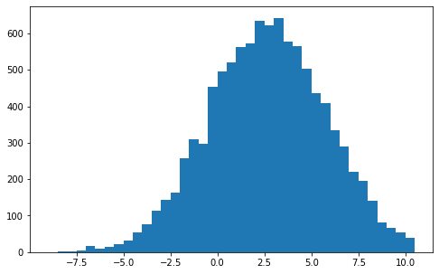
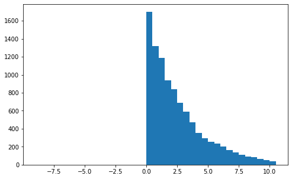

# Fitting Distributions Project

## Overview

A perennial problem in everyday life is weighing the truth of various hypotheses when presented some data.  In classical statistics, an example of this problem is estimating the best probability distribution that fits a sequence of samples.  This project recreates from scratch in python a number of core statistical methods used to address the problem of fitting distributions to data.  Additionally, I experiment with a number of optimization techniques to estimate those distribution parameters.  I show that these techniques are intractable due to limits in representing floating point numbers.

The problem of fitting distributions to data is useful for identifying statistical models that can then predict the data.  For example, suppose a company is collecting data on quarterly sales on their products.  I can model data on those sales as being generated by specific probability distributions, and I can then apply the methods discussed here to find the best distribution that fits the data.  This will then allow the company to predict how their quarterly sales might evolve in the future.  **The key takeaway is that the statistical modeling I demonstrate in this project can be helpful for making predictions about the things modeled.**

My key methods include **maximum likelihood estimation, Newton's method, gradient ascent, Z-tests, K-S tests, confidence intervals, posteriors, and Bayes factors**.

## Data Sets

Each data set consisted of 10,000 floats.  There were 15 total data sets stored in txt files, where the floats were separated by line breaks.

I manipulated the data set by importing it into python and converting the resultant list as a 1 dimensonional `numpy` array.

To better understand the imported data sets, I first visualized a selection of them using `matplotlib`.  This was done in a Jupyter Notebook, which can be found [here](Data/distfit_histograms.ipynb).

Examples of the generated histograms are below.

Data Set d1.txt | Data Set d3.txt
:--------------:|:---------------:
 | 

Note that the first data set has a clearly exponential distribution form, and the third data set has a more Gaussian form.

## Statistical Methods

I employed a battery of statistical methods and tests, including frequentist and Bayesian methods.  The principal method used was **maximum likelihood estimation** (MLE).  Intuitively, maximum likelihood estimation says the correct model is the one that best fits the data.  More concretely, this is the model that maximizes the likelihood of the data given the model or if $x_{0}, \dots, x_{n}$ are our data and $m \in M$ and $\theta \in \Theta$ are our models and parameters respectively, then the likelihood function $l$ is:

$$ l(\theta) = \underset{\theta, m}{\arg \max} P(x_{0}, \dots, x_{n}  |  \theta; m) $$

Typically, the log-likelihood is used, and an important assumption in MLE is that data are independent and identically distributed.  I followed these practices, which enables an easy computation of the likelihoods for each data sample.

The hypothetical models I considered were the *uniform*, *normal (Gaussian)*, and *exponential* distributions.  A nice feature of MLE is that in the case of these hypotheses, MLE estimates can be computed analytically.  I wrote custom code in python to do this, though in practice one would typically rely upon a library such as `scipy.stats`.

Finally, statistical tests were run on the different maximum likelihood estimators.  Tests are typically broken down into two categories:  frequentist and Bayesian.  

Frequentist methods rely upon null hypothesis testing and confidence intervals (these are effectively the same).  In null hypothesis testing, a null hypothesis is assumed and then we compute the probability that that our data would be as extreme or more so than what was observed; if that probability exceeds a certain threshold, the null is rejected.  I used **Z-tests** and **K-S tests** for null hypothesis testing, with the Z-test involving custom code and the K-S test using the `scipy.stats` package.  Confidence intervals likewise assume some statistical model is correct, and one estimates an interval on which values the data must have obtained at certain levels of probability.  I constructed confidence intervals at the **0.9, 0.95, 0.99, and 0.999** probabilities using custom code and functions from `numpy`.

While frequentist methods aim to falsify hypotheses, Bayesian methods try to directly estimate the probabilities of hypotheses.  The main method is to estimate for some prior probability, the posterior probability given by Bayes theorem:

$$ P(H | E) = \frac{P(E | H) P(H)}{P(E)} $$

In my models, I assumed a uniform prior over the different estimators.  This is just to use the heuristic the highest likelihood is best.  I constructed custom code to compute the posterior.  Or if the prior is not assumed to be given, we can estimate what is a called a Bayes factor, which is the ratio of marginal probability of the observation between models.  I computed **pairwise Bayes factors across the different models**.

## Machine Learning Methods

I wanted to test whether local search methods could be used to compute model parameters.  **This is important because not every probability distribution has parameters that can be analytically computed**.  Since in this case I could easily find the distribution parameters that maximumize the likelihoods, I could check my local search methods against the correct parameters.

Two methods were employed:  **Newton-Rhapson** and **Gradient Ascent**.  In both methods, I used the log-likelihood for parameter estimation.

Newton-Rhapson is a modification of Newton's method for estimating probability distributions.  Newton's method is an optimization method that searchs for the roots of functions by using ratio of the function to its first derivative.  Intuitively, we can picture this as iteratively finding the tangent line that sets the function to zero.  In the Newton-Rhapson method, we instead aim to solve for the zeros of the likelihood function's first derivative because this will correspond to the parameters that maximize the likelihood.  To do this, we iterate over a model's parameters by subtracting our current best estimate of the models parameters by the ratio of the likelihood function's first and second derivatives on the current best guess's input:

$$ \theta_{k+1} = \theta_{k} - \frac{l^{\prime}(\theta_{k})}{l^{\prime\prime}(\theta_{k})} $$

Since this is an approximation that is computed, it is important to have stopping criteria for my estimators.  Typically, this is either a fixed number of iterations or when the changes in parameter estimates fall below a threshold.  I used 1000 iterations as my stopping threshold or a percentage change in solution that is less than 0.00000001.  As I discuss below, this method requires certain assumptions to hold, the initial first guess to be "sufficiently close", and the likelihood function to be well-behaved.  I built custom code for the Newton-Rhapson method, which can be found in [distfit.py](distfit.py).

Gradient Ascent is the same local search method as **Gradient Descent**.  The difference is that we seek to maximize a function in ascent as opposed to minimizing a function by adding instead of subtracting our gradient.  Intuitively, these methods work by following the slope of a function until you reach a peak (for ascent) or valley (for descent).  In terms of math, this means we adjust our estimation by adding the list of partial derivatives of our likelihood estimation times some constant $\eta$:

$$ \theta_{k+1} = \theta_{k} + \eta \nabla l(\theta_{k}) $$

Various $\eta$ s were employed, and I found that an $\eta = 0.01$ to be most effective.  Like Newton's method, a stopping criteria is typically employed.  Here I used 10000 iterations.  I wrote custom code for Gradient Ascent, which can also be found in [distfit.py](distfit.py).

## Experiments

My experiments fall into two classes:  parameter estimation and model selection.  In parameter estimation, MLEs were computed either analytically or through the two optimization algorithms discussed in the previous section.  I ran both the Newton-Rhapson and Gradient Ascent methods on solutions for likelihood paramters.  

The principal difficulty found with Newton-Rhapson was that with the uniform and normal distributions the first and second derivatives for the log-likelihoods are not well-behaved.  In particular, the second derivatives grow very rapidly, which results in numbers that cannot be stored in 64 or even 128-bit floats.  The exponential distribution, however, performed excellently, and the Newton-Rhapson method very quickly converged to the correct value.

Gradient Ascent, however, failed to perform well on any distribution parameter estimator.  The algorithm would very frequently converge on sub-optimal paramters for the likelihood estimators.  Inspection of the log-likelihood functions revealed that they have multiple local maxima, which means that Gradient Ascent will very likely get stuck.

Model selection experiments used MLEs that were computed analytically on each of the 15 data sets.  I then tested each model's likelihood estimate with the battery of statistical methods documented above.  All experiments went well, and they can be duplicated in [distfit.py](distfit.py).

## Results

Below is the result for d3.txt with the parameters estimated for each possible distribution and the results of the tests run on it.  Results can be found in the table below.  The distribution that most matched the data set is $\mathcal{N}(2.70365376, 3.1503997)$.  Confidence intervals at the 0.95 level for the mean is (2.641907065522342, 2.765400464393057) and for the variance is (3.1200908941338077, 3.1807085003864715).  All tests agreed with this conclusion.

**Distribution** | **Log-likelihood** | **Z-test P-value** | **KS-test P-value** | **MLE Posterior** | **Bayes Factor**
:---------------:|:------------------:|:------------------:|:-------------------:|:-----------------:|:----------------:
$\mathcal{N}(2.70365376, 3.1503997)$ | -30679.03048238257 | 1.0 | 0.8351413598816311 | 1.0 | $\mathcal{U}$ 724.66654471, $Exp$ 187841.26468958
$\mathcal{U}(-8.36011 14.7523)$ | -31403.697027089074 | 0.0 | 0.0 | 1.91125...e-315 | $\mathcal{N}$ -724.66654471, $Exp$ 187116.59814487
$Exp(0.36986985)$ | -218520.29517196323 | 0.0 | 0.0 | 0.0 | $\mathcal{N}$ -187841.26468958, $\mathcal{U}$ -187116.59814487

Other results were similar, with most tests agreeing on models for the generating distributions.  A table of results can be found in [tables.pdf](tables.pdf).

## Discussion

Overall, the methods employed here did a good job at estimating the generating distributions.  There was some disagreement in the methods, with the Z-test and K-S test sometimes disagreeing.  The most likely reason for this discrepancy is due to the Z-test relying upon a normal distribution on models.  The most reliable estimations were given by the MLE posterior and Bayes factors.

The **key takeaway is that these statistical techniques showed the robust ability at finding generating distributions found in the hypothesis partition**.  Once identified, the generating distributions can then be used to make predictions about future observations.

Lastly, both the Newton-Rhapson and Gradient Ascent methods for computing model parameters showed important limitations.  For them to be successful, careful analysis of the functional form of hypotheses and their derivatives needs to be used.  In the case of the exponential distribution, Newton's method proved tractable and an excellent option to standard analytical techniques.  But on normal and uniform distributions, both Newton's method and Gradient Ascent had difficulty due to the behavior of the derivatives and optimizing functions.
